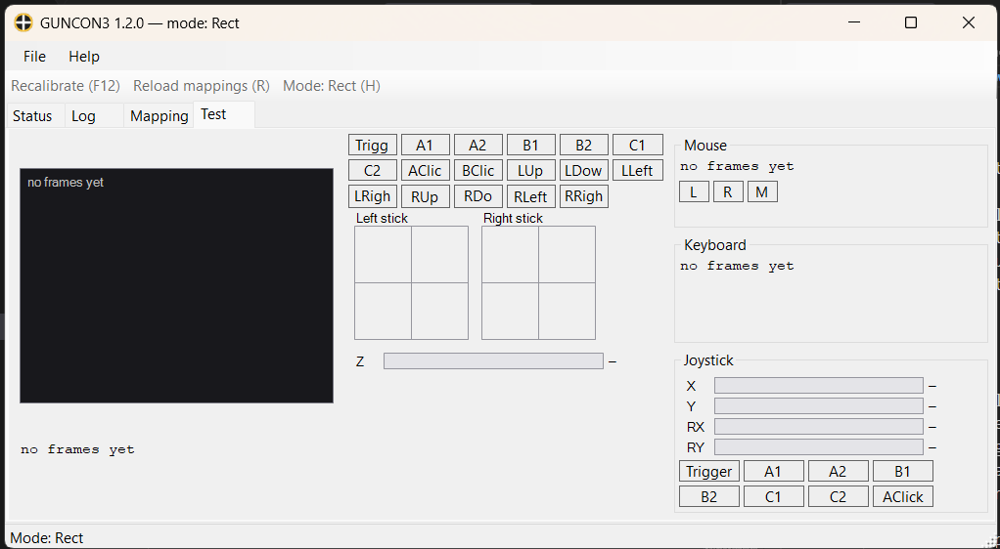

# Guncon3Windows

> Use **GunCon 3** on Windows, with calibration built in.

A fork ported to **.NET 10**: the input path reworked, one thread per gun, both sticks
exposed digitally and as a virtual Xbox 360 controller, and a GUI with a tray icon.
Windows 11 friendly: the cursor and keys go through `SendInput`, the controller through
ViGEmBus. Install the gun's driver, run the executable, and it calibrates itself on
first launch.



## Features

- A GUI and a tray icon: a row per gun with its connection, calibration and feeder
  state, a live log, a mapping editor and a live test view. Closing hides it to the tray.
- Five-point calibration (four corners and the centre) 
  capture: the linear rectangle and a projective 
- Both analog sticks digitalized and mappable, plus a virtual Xbox 360 controller with both
  sticks, the depth axis on the left trigger and the nine buttons.
- An unplugged gun is reported, releases its buttons and reconnects by itself.
- Multiple guns, each on its own thread. Multi-monitor: the aim follows the monitor it was calibrated on.
  Two guns share one cursor, so a mouse button or key mapped on both is released when either gun lets go.
- Local configuration files, with mapping errors reported by line number.

Three virtual outputs:

| output | how | carries |
|---|---|---|
| absolute mouse | `SendInput`, no driver | aiming over the virtual desktop, plus any button mapped to `MOUSE.*` |
| keyboard | `SendInput`, no driver | any button mapped to `KEYBOARD.*`, as key-down / key-up by scan code |
| Xbox 360 controller | ViGEmBus, one pad per gun | both sticks, depth on the left trigger, and the nine buttons — always, no mapping needed |

One gun button can produce a keyboard key and a controller button at once. The controller
layout is fixed:

| gun | Xbox 360 |
|---|---|
| Trigger | A |
| A1 | B |
| A2 | X |
| B1 | Y |
| B2 | LB |
| C1 | RB |
| C2 | Start |
| AClick | left stick click |
| BClick | right stick click |

## Requirements

Windows x64 and the **GunCon 3 WinUSB driver** ([`drivers/`](drivers/)), installed as
Administrator. The framework-dependent build also needs the **.NET 10 *Desktop* Runtime**.

Optional: **[ViGEmBus 1.22.0](https://github.com/nefarius/ViGEmBus/releases)** for the
virtual Xbox 360 controller. Without it the mouse and keyboard still work; the Status tab
shows the joystick as *failed* and the log says what to install. ViGEm is end-of-life
(2023) but its last release is signed and installs on Windows 10 and 11.

Two things `SendInput` cannot do:

- Reach a window more elevated than this process. A game run as Administrator ignores the
  gun unless the app runs as Administrator too. Windows may or may not report the drop:
  when it does, the Status tab shows mouse and keyboard as *failed* with win32 error 5 in
  the log; when it does not, everything looks fine and nothing moves. Either way,
  elevation is the first thing to check.
- Fool anti-cheat. Injected input is flagged as such, and a game that filters on the flag
  will not see the gun. Emulators (MAME, RetroArch, Demul, TeknoParrot) do.

## Building

```
dotnet build src/Guncon3.sln
dotnet test tests/Guncon3.Core.Tests/Guncon3.Core.Tests.csproj

# release, one exe: --self-contained (<200 MB) or --self-contained false (~0.5 MB)
dotnet publish src/Guncon3Console/Guncon3Console.csproj -c Release -r win-x64 --self-contained -p:PublishSingleFile=true -p:IncludeNativeLibrariesForSelfExtract=true
```

On macOS or Linux add `-p:EnableWindowsTargeting=true`;

## Running

```
Guncon3Console.exe                       the window and the tray icon
Guncon3Console.exe --console             the console mode, as before
Guncon3Console.exe keys                  print the keycode table and exit
Guncon3Console.exe dump [count] [file]   capture raw USB frames (default 500, packets.txt)
```

Only one copy runs per Windows user session: starting it again brings the running copy
to the front, from the tray too, and exits. A second `--console` or `dump` says so and
exits with code 1; `keys` is never blocked.

### The window

**F12** recalibrates every gun, **R** reloads the mapping files, **H** toggles the
linear and projective mapping. The toolbar, the tray menu and those keys do the same;
the keys need the window focused. The mode is not remembered across runs.

- **Status** — device, connection, which calibration, and whether each virtual device still accepts reports.
- **Log** — everything the app says, warnings amber, errors red, with Clear and Copy all.
- **Test Input** — one gun live: both calibrated aims as crosshairs (grey raw, white
  linear, cyan projective, the live one thicker), every button and stick direction.
- **Test Output** — what the three virtual devices were last told for that gun, each with
  its feeder's health. Both Test tabs only watch, refresh about thirty times a second
  while open, and stop when you leave them.
- **Mapping** — edits `mapping*.txt`; see below.
- **ESC** or the close button hides to the tray; double-clicking the icon brings it back.
  **File → Exit** or the tray's **Exit** releases every held button and ends the process,
  as does logging out.
- A start with no gun opens on the Log tab and offers **Search again** in the **File**
  and tray menus. Plug one in, press it, and the session carries on. No restart.

**File → Settings…** writes `settings.txt`: start minimised to the tray, run at Windows
logon (`HKCU\Software\Microsoft\Windows\CurrentVersion\Run`), and write the log to
`guncon3.log`. It is `key=value`, `#` for comments, keys case-insensitive, unknown keys
left alone.

`--console` keeps the old behaviour: the log in the console window, **F12** / **R** /
**H** / **ESC** as console keys while it has focus, **Ctrl+C** and **Ctrl+Break** to
exit cleanly. The executable is a Windows application now, so it attaches to the
shell's console or opens one.

### The calibration window

| phase | gun | keyboard | does |
|---|---|---|---|
| shooting | Trigger | Space | capture the current target |
| any | A1 | Backspace | start the five shots over |
| check | A2 | H | switch the white crosshair between linear and projective |
| check | C2 | Enter | **save** and close |
| any | B1 / B2 | ← / → | move to the previous / next monitor (restarts the capture) |
| any | — | D | show the raw gun coordinates |
| any | — | ESC | cancel; the previous calibration stays |

Five shots that do not span a rectangle are thrown away with a message. A mouse click does nothing here, because with two guns the other gun's mouse is live. The check phase prints the projective centre error as a fraction of the screen; above 0.05 it is suspect, so redo the capture.

## Button mapping

`mapping.txt` sits next to the executable, one `DEVICE.COMMAND = GUNCOMMAND` per line,
for example `KEYBOARD.30 = C1` or `MOUSE.Left = Trigger`. Gun 2 reads `mapping_2.txt`,
and so on. Names are case-insensitive, and every line that cannot be understood is
reported on startup with its line number.

Gun commands are the nine buttons `Trigger`, `A1`, `A2`, `B1`, `B2`, `C1`, `C2`,
`AClick`, `BClick`, plus the stick directions `LUp` / `LDown` / `LLeft` / `LRight` and
`RUp` / `RDown` / `RLeft` / `RRight`. Keyboard codes come from `Guncon3Console.exe keys`,
also in [docs/keycodes.txt](docs/keycodes.txt).

Keys are sent by physical position (scan code), so on a non-US layout a label names the US
key at that position: `a` fires the key that is `q` on AZERTY.

The **Mapping** tab edits the same files: pick one, set a keyboard code and a mouse
button per gun button, and **Save** writes it with its comment header kept and reloads
every gun at once. A yellow banner reports lines it could not understand, dropped on
save after it asks, and any keycode shared by two buttons, which the format allows.

## Configuration files

| file | written by | notes |
|---|---|---|
| `mapping.txt` | you | gun 2 reads `mapping_2.txt`, … |
| `calibration_rect.txt` | the calibration window | per gun; the five raw points, the derived rectangle and the monitor's position. Older files have no points and load on the linear mapping until you recalibrate |
| `stick_centre.txt` | measured automatically | per gun; delete it to re-measure |
| `settings.txt` | the Settings dialog | unknown keys are kept |
| `guncon3.log` | the app, when that setting is on | appended, never rotated |

A failure also writes `cal_capture_error.txt`, `cal_save_error.txt` or
`cal_read_error.txt` next to the executable and logs the path. Stick centres come from
the first 60 frames after startup, so **do not hold a stick while it starts**; delete
`stick_centre.txt` to measure again.

## Notes

- Recalibrate after changing monitor, resolution or arrangement. If the calibrated
  monitor is gone the app says so and aims screen-relative until you do.
- The aim is offset onto the calibrated monitor because `SendInput`'s absolute
  coordinates span the whole virtual desktop. On one monitor this changes nothing.
- An uncalibrated gun does not move the cursor at all; its buttons still work.
- A key or mouse button the app holds when it is killed stays held until you press it
  physically — `SendInput` has no timeout. A normal exit, the tray's Exit and logoff all
  release everything first.
- Licensed **GPL-2.0**, inherited from [sonik-br](https://github.com/sonik-br/GunconUSB).

---

© 2026 AnimaVitis · Fork of [sonik-br/GunconUSB](https://github.com/sonik-br/GunconUSB)
